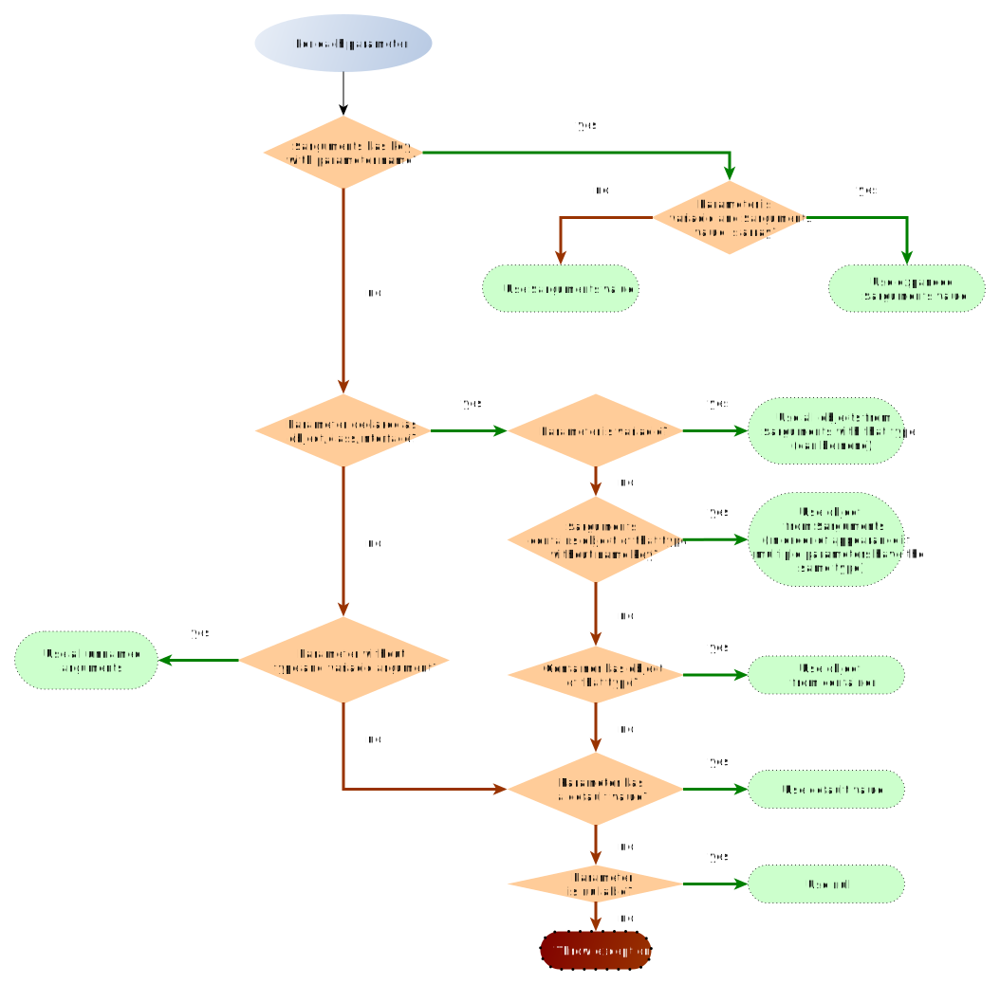

<p align="center">
    <a href="https://github.com/yiisoft" target="_blank">
        
    </a>
    <h1 align="center">Yii Injector</h1>
    <br>
</p>

[](https://packagist.org/packages/yiisoft/injector)
[](https://packagist.org/packages/yiisoft/injector)
[](https://github.com/yiisoft/injector/actions)
[](https://scrutinizer-ci.com/g/yiisoft/injector/)
[](https://scrutinizer-ci.com/g/yiisoft/injector/?branch=master)
[](https://dashboard.stryker-mutator.io/reports/github.com/yiisoft/injector/master)
[](https://github.com/yiisoft/injector/actions?query=workflow%3A%22static+analysis%22)
[](https://shepherd.dev/github/yiisoft/injector)

A [dependency injection](https://en.wikipedia.org/wiki/Dependency_injection)
implementation based on autowiring and
[PSR-11](https://www.php-fig.org/psr/psr-11/) compatible dependency injection containers.

Injector can automatically resolve and inject dependencies when calling
functions and creating objects.

It therefore uses [Reflection](https://www.php.net/manual/en/book.reflection.php) to analyze the
parameters of the function to call, or the constructor of the class to
instantiate and then tries to resolve all arguments by several strategies.

The main purpose is to find dependency objects - that is arguments of type
object that are declared with a classname or an interface - in a (mandatory)
[PSR-11](https://www.php-fig.org/psr/psr-11/) compatible *dependency injection
container* (DIC). The container must therefore use the class or interface name
as ID.

In addition, an array with arguments can be passed that will also be scanned for
matching dependencies. To make things really flexible (and not limited to
objects), arguments in that array can optionally use a function parameter name
as key. This way basically any callable can be invoked and any object
be instantiated by the Injector even if it uses a mix of object dependencies and
arguments of other types.

#### Features

- Injects dependencies when calling functions and creating objects
- Works with any dependency injection container (DIC) that is [PSR-11](https://www.php-fig.org/psr/psr-11/) compatible
- Accepts additional dependencies and arguments passed as array
- Allows passing arguments *by parameter name* in the array
- Resolves object type dependencies from the container and the passed array
   by [parameter type declaration](https://www.php.net/manual/en/functions.arguments.php#functions.arguments.type-declaration)
- Resolves [variadic arguments](https://www.php.net/manual/en/functions.arguments.php#functions.variable-arg-list)
   i.e. `function (MyClass ...$a)`

## Requirements

- PHP 7.4 or higher.

## Installation

The package could be installed with [Composer](https://getcomposer.org):

```shell
composer require yiisoft/injector
```

## General usage

```php
use Yiisoft\Di\Container;
use Yiisoft\Di\ContainerConfig;
use Yiisoft\Injector\Injector;

$config = ContainerConfig::create()
    ->withDefinitions([
        EngineInterface::class => EngineMarkTwo::class,
    ]);
$container = new Container($config);

$getEngineName = static function (EngineInterface $engine) {
    return $engine->getName();
};

$injector = new Injector($container);
echo $injector->invoke($getEngineName);
// outputs "Mark Two"
```

In the code above we feed our container to `Injector` when creating it. Any [PSR-11](https://www.php-fig.org/psr/psr-11/)
container could be used. When `invoke` is called, injector reads method signature of the method invoked and, based on
type hinting automatically obtains objects for corresponding interfaces from the container.

Sometimes you either don't have an object in container or want to explicitly specify arguments. It could be done
like the following:

```php
use Yiisoft\Injector\Injector;

/** @var $dataProvider DataProvider */
$dataProvider = /* ... */;
$result = (new Injector($container))->invoke([$calculator, 'calculate'], ['multiplier' => 5.0, $dataProvider]);
```

In the above the "calculate" method looks like the following:

```php
public function calculate(DataProvider $dataProvider, float $multiplier)
{
    // ...
}
```

We have passed two arguments. One is `multiplier`. It is explicitly named. Such arguments passed as is. Another is
data provider. It is not named explicitly so injector finds matching parameter that has the same type.

Creating an instance of an object of a given class behaves similar to `invoke()`:

```php
use Yiisoft\Injector\Injector;

class StringFormatter
{
    public function __construct($string, \Yiisoft\I18n\MessageFormatterInterface $formatter)
    {
        // ...
    }
    public function getFormattedString(): string
    {
        // ...
    }
}

$stringFormatter = (new Injector($container))->make(StringFormatter::class, ['string' => 'Hello World!']);

$result = $stringFormatter->getFormattedString();
```

The object isn't saved into container so `make()` works well for short-living dynamically created objects.

## How it works

Both `invoke()` and `make()` are selecting arguments automatically for the method or constructor called based on
parameter names / types and an optional array of explicit values.

Algorithm is the following:



Additionally:

* Passing unnamed argument that is not an object results in an exception.
* Each argument used only once.
* Unused unnamed explicit arguments are passed at the end of arguments list. Their values could be obtained with
  `func_get_args()`.
* Unused named arguments are ignored.
* If parameters are accepting arguments by reference, arguments should be explicitly passed by reference:

  ```php
  use Yiisoft\Injector\Injector;
  
  $foo = 1;
  $increment = function (int &$value) {
      ++$value;
  };
  (new Injector($container))->invoke($increment, ['value' => &$foo]);
  echo $foo; // 2
  ```

## Reflection caching

`Injector` uses `Reflection API` to analyze class signatures. By default, it creates new `Reflection` objects each time.
Call `withCacheReflections(true)` to prevent this behavior and cache reflection objects.
It is recommended to enable caching in production environment, because it improves performance.
If you use async frameworks such as `RoadRunner`, `AMPHP` or `Swoole` don't forget to reset injector state.

```php
use Yiisoft\Injector\Injector;

$injector = (new Injector($container))
    ->withCacheReflections(true);
```

By default, caching is disabled.

## Documentation

- Guide: [Russian](docs/guide/ru/README.md)
- [Internals](docs/internals.md)

If you need help or have a question, the [Yii Forum](https://forum.yiiframework.com/c/yii-3-0/63) is a good place for that.
You may also check out other [Yii Community Resources](https://www.yiiframework.com/community).

## License

The Yii Injector is free software. It is released under the terms of the BSD License.
Please see [`LICENSE`](./LICENSE.md) for more information.

Maintained by [Yii Software](https://www.yiiframework.com/).

## Support the project

[](https://opencollective.com/yiisoft)

## Follow updates

[](https://www.yiiframework.com/)
[](https://twitter.com/yiiframework)
[](https://t.me/yii3en)
[](https://www.facebook.com/groups/yiitalk)
[](https://yiiframework.com/go/slack)
