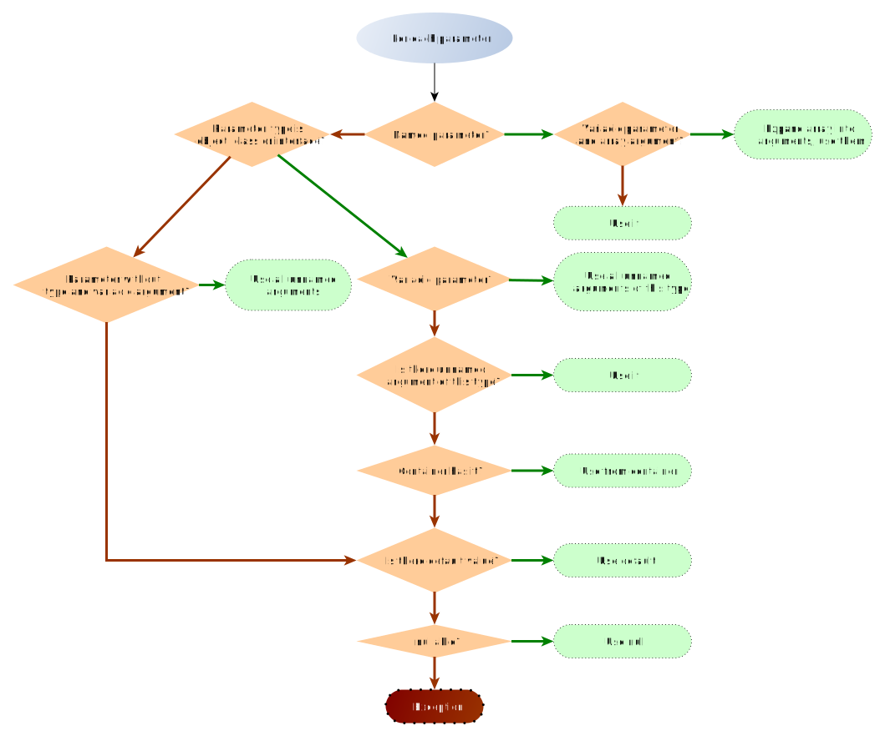

# Injector package

## General usage

```php
use Yiisoft\Di\Container;
use Yiisoft\Injector\Injector;

$container = new Container([
    EngineInterface::class => EngineMarkTwo::class,
]);

$getEngineName = static function (EngineInterface $engine) {
    return $engine->getName();
};

$injector = new Injector($container);
echo $injector->invoke($getEngineName);
// outputs "Mark Two"
```

In the code above we feed our container to `Injector` when creating it. Any [PSR-11](https://www.php-fig.org/psr/psr-11/)
container could be used. When `invoke` is called, injector reads method signature of the method invoked and, based on
type hinting automatically obtains objects for corresponding interfaces from the container.

Sometimes you either don't have an object in container or want to explicitly specify arguments. It could be done
like the following:

```php
use Yiisoft\Injector\Injector;

/** @var $dataProvider DataProvider */
$dataProvider = /* ... */;
$result = (new Injector($container))->invoke([$calculator, 'calculate'], ['multiplier' => 5.0, $dataProvider]);
```

In the above the "calculate" method looks like the following:

```php
public function calculate(DataProvider $dataProvider, float $multiplier)
{
    // ...
}
```

We have passed two arguments. One is `multiplier`. It is explicitly named. Such arguments passed as is. Another is 
data provider. It is not named explicitly so injector finds matching parameter that has the same type.

Creating an instance of an object of a given class behaves similar to `invoke()`:

```php
use Yiisoft\Injector\Injector;

class StringFormatter
{
    public function __construct($string, \Yiisoft\I18n\MessageFormatterInterface $formatter)
    {
        // ...
    }
    public function getFormattedString(): string
    {
        // ...
    }
}

$stringFormatter = (new Injector($container))->make(StringFormatter::class, ['string' => 'Hello World!']);

$result = $stringFormatter->getFormattedString();
```

The object isn't saved into container so `make()` works well for short-living dynamically created objects.

## How it works

Both `invoke()` and `make()` are selecting arguments automatically for the method or constructor called based on
parameter names / types and an optional array of explicit values.

Algorithm is the following:



Additionally:

* Passing unnamed argument that is not an object results in an exception.
* Each argument used only once.
* Unused unnamed explicit arguments are passed at the end of arguments list. Their values could be obtained with
  `func_get_args()`.
* Unused named arguments are ignored.
* If parameters are accepting arguments by reference, arguments should be explicitly passed by reference:
  ```php
  $foo = 1;
  $increment = function (int &$value) {
      ++$value;
  };
  (new Injector($container))->invoke($increment, ['value' => &$foo]);
  echo $foo; // 2
  ```
