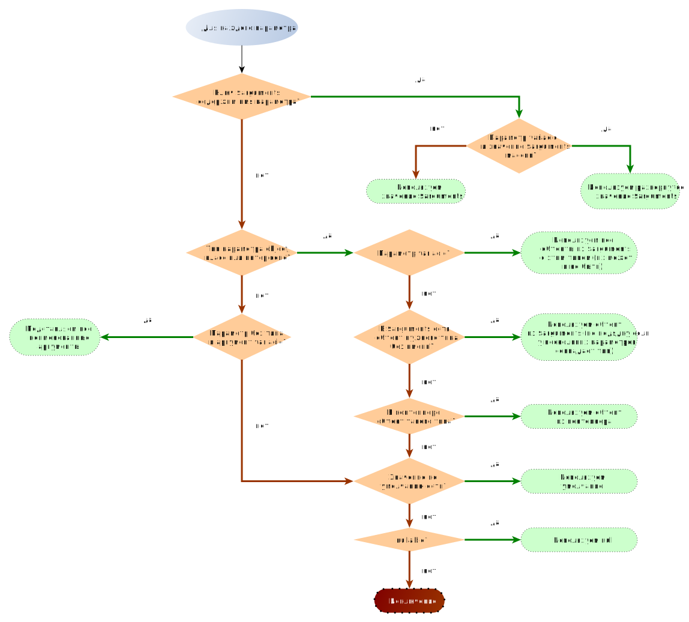

# Пакет Injector

## Использование

```php
use Yiisoft\Di\Container;
use Yiisoft\Di\ContainerConfig;
use Yiisoft\Injector\Injector;

$config = ContainerConfig::create()
    ->withDefinitions([
        EngineInterface::class => EngineMarkTwo::class,
    ]);

$container = new Container($config);

$getEngineName = static function (EngineInterface $engine) {
    return $engine->getName();
};

$injector = new Injector($container);
echo $injector->invoke($getEngineName);
// выведет "Mark Two"
```

В приведённом выше коде при создании `Injector` мы передаём аргументом экземпляр контейнера. Может быть использован
любой совместимый с [PSR-11](https://www.php-fig.org/psr/psr-11/) контейнер. При вызове `invoke`, injector читает
сигнатуру вызываемого метода и на основе типов параметров автоматически достаёт соответствующие экземпляры объектов из
контейнера.

В некоторых случаях у вас либо нет объекта в контейнере либо вы хотите задать аргументы явно. Сделать это можно так:

```php
use Yiisoft\Injector\Injector;

/** @var $dataProvider DataProvider */
$dataProvider = /* ... */;
$result = (new Injector($container))->invoke([$calculator, 'calculate'], ['multiplier' => 5.0, $dataProvider]);
```

Метод "calculate" выглядит вот так:

```php
public function calculate(DataProvider $dataProvider, float $multiplier)
{
    // ...
}
```

Мы передали два аргумента. Один из них назван явно, `multiplier`. Такие аргументы передаются как есть. Второй - data
provider. У него нет явного имени, поэтому injector пытается подставить его в параметр с тем же типом.

Создание экземпляра объекта заданного класса происходит так же, как и вызов `invoke()`:

```php
use Yiisoft\Injector\Injector;

class StringFormatter
{
    public function __construct($string, \Yiisoft\I18n\MessageFormatterInterface $formatter)
    {
        // ...
    }
    public function getFormattedString(): string
    {
        // ...
    }
}

$stringFormatter = (new Injector($container))->make(StringFormatter::class, ['string' => 'Hello World!']);

$result = $stringFormatter->getFormattedString();
```

Полученный объект не сохранятся в контейнер, так что метод хорошо подходит для динамического создания объектов с коротким
жизненным циклом.

## Как это работает

Как метод `invoke()`, так и метод `make()` автоматически выбирают аргументы для вызываемого метода или конструктора
на основе типов и имён параметров и опционального массива задаваемых явно значений.

Происходит это согласно приведённому ниже алгоритму.



Дополнительно:

* Передача неименованного аргумента, который не является объектом, приводит к исключению.
* Каждый аргумент используется только один раз.
* Неиспользованные явные неименованные аргументы передаются в конце списка аргументов. Значения этих аргументов
  могут быть получены функцией `func_get_args()`.
* Неиспользованные именованные аргументы игнорируются.
* Если параметры функции принимают аргументы по ссылке, то для правильной передачи переменной по ссылке, вам следует
  указывать аргументы также по ссылке:
  ```php
  $foo = 1;
  $increment = static function (int &$value) {
      ++$value;
  };
  (new Injector($container))->invoke($increment, ['value' => &$foo]);
  echo $foo; // 2
  ```

## Кэширование рефлексий

В процессе создания объекта инжектор использует рефлексию создаваемого класса. В случаях, когда создаётся много объектов
одного и того же класса, для повышения производительности можно включить кэширование рефлексий с помощью параметра
`cacheReflections` в конструкторе `Injector` (по умолчанию выключен):

```php
$injector = new Injector($container, true);
```
